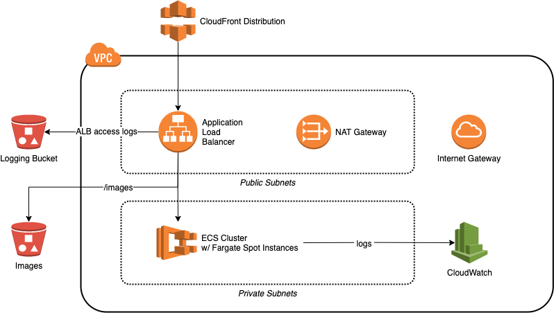

## Example Go app + infrastructure

### Deploying the stack

First, edit `infra/vars.tfvars` and set the infrastructure variables as required. The stack assumes you have two ACM certificates pre-provisioned - one for the CloudFront distribution, and another for the ALB backend. You will also need an image repository for the Docker build.

After setting the variables, from the root directory, run the following command, modifying the Docker image repo:

```
DOCKER_IMAGE_REPO="docker.io/me/my-repo" make
```

This will do the following:

* Build the application Docker image
* Push the Docker image to your repo
* Deploy the application infrastructure

Terraform will return a CloudFront domain that can be used to point DNS at.

The application runs in an ECS service that is configured to use Fargate spot instances. This allows for easy and cost-effective scaling of the service. The number of instances can be easily dialled up or down in the ECS service, or configured to use service autoscaling. The application is also configured with a CloudFront distribution in front of the app, for offloading requests from the backend. The CloudFront distribution also sends requests for `/images` to an S3 bucket.

### Infrastructure Architecture



The following components are created by the Terraform configs:
* a VPC with public and private subnets, route tables etc.
* an Application Load Balancer with listeners
* security groups for the ALB and Fargate tasks
* an ECS service for the application
* an S3 bucket for storing image files
* a CloudFront distribution for caching

### Notes

* To keep costs down this stack only implements a single NAT gateway for all three private subnets - this is not ideal for a production environment.
* The ALB security groups are configured to allow inbound traffic from any IP address - ideally this should be locked down to CloudFront IP ranges, using something like [this](https://aws.amazon.com/blogs/security/how-to-automatically-update-your-security-groups-for-amazon-cloudfront-and-aws-waf-by-using-aws-lambda/).
* The CloudFront distribution is not setup to use the WAF - this would be an obvious next step.
